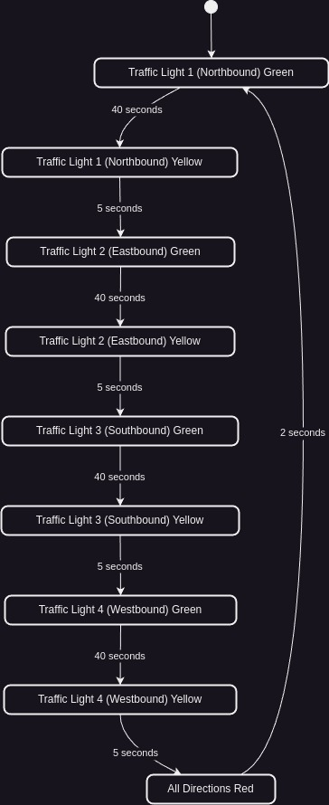

# Gishushu 4-Way Traffic Lights System

This document outlines the operational rules and state diagram for the 4-way traffic lights system at the Gishushu intersection in Kigali, Rwanda.

### 1. Components

Each traffic light (TL) controls three directional flows (Left, Straight, Right) for one of the four roads:

- **TL1:** Controls Northbound traffic.
- **TL2:** Controls Eastbound traffic.
- **TL3:** Controls Southbound traffic.
- **TL4:** Controls Westbound traffic.

Each light operates with the following signals:

- **Green Arrow (Direction-specific):** Allows vehicles to proceed in the given direction.
- **Yellow Arrow:** Warns vehicles to prepare to stop.
- **Red Arrow:** Stops vehicles for the given direction.

---

### 2. Operational Rules

1. **Default Configuration:**

   - Only one direction (e.g., Northbound TL1) operates with green arrows at a time.
   - All other traffic lights remain red in their respective directions.

2. **State Transitions:**

   - Each traffic light transitions from **Green** ➔ **Yellow** ➔ **Red**.
   - The cycle moves clockwise:
     - TL1 (North) ➔ TL2 (East) ➔ TL3 (South) ➔ TL4 (West).

3. **Timing Rules:**

   - **Green Light Duration:** 40 seconds per direction.
   - **Yellow Light Duration:** 5 seconds.
   - **All Red State:** 2 seconds to ensure intersection clearance.

4. **Priority and Safety:**
   - No conflicting green lights for crossing directions.
   - Turn signals can overlap non-conflicting directions (e.g., TL1's Left Turn can align with TL3's Right Turn).

---

## State Diagram

Below is the state diagram of the 4-way traffic light system.

### Example Cycle:

Here is how one complete cycle will operate, moving clockwise through each direction:

- **Phase 1 (TL1 - Northbound)**:
    - TL1 shows a **Green Arrow** for 40 seconds (Northbound vehicles can go straight, left, or right).
    - After 40 seconds, TL1 switches to **Yellow Arrow** for 5 seconds (warning to prepare to stop).
    - Then, TL1 transitions to **Red Arrow** for 2 seconds (all red clearance).

- **Phase 2 (TL2 - Eastbound)**:
    - TL2 switches to **Green Arrow** for 40 seconds (Eastbound vehicles can go straight, left, or right).
    - After 40 seconds, TL2 shows a **Yellow Arrow** for 5 seconds.
    - TL2 then transitions to **Red Arrow** for 2 seconds.

- **Phase 3 (TL3 - Southbound)**:
    - TL3 shows a **Green Arrow** for 40 seconds (Southbound vehicles can go straight, left, or right).
    - After 40 seconds, TL3 transitions to **Yellow Arrow** for 5 seconds.
    - Then, TL3 turns **Red** for 2 seconds.

- **Phase 4 (TL4 - Westbound)**:
    - TL4 shows a **Green Arrow** for 40 seconds (Westbound vehicles can go straight, left, or right).
    - After 40 seconds, TL4 switches to **Yellow Arrow** for 5 seconds.
    - Finally, TL4 transitions to **Red Arrow** for 2 seconds.
